```{r setup, include=FALSE}
knitr::opts_chunk$set(echo = TRUE, fig.align = "center")
```

# Introduction

Ce tutoriel explique pas à pas comment installer R version 4.0.5 et R Commander version 2.7-1 (les dernières versions de ces logiciels au 2021-05-03) sous Windows 10. Assurez-vous d'avoir un PC suffisamment puissant. Évitez les chromebooks, les ordinateurs dédiés à du travail léger, ou trop vieux (plus ancien que 3 ou 4 ans). Un ordinateur muni d'un processeur Core i3, i5, i7 ou i9 de 6^ème^ génération ou plus, d'un processeur AMD Ryzen 5 ou plus, de minimum 4Go de mémoire vive (si possible 8Go), d'un disque dur rapide d'au moins 256Go, et d'un écran de 1920x1080 minimum devrait convenir. Vous devez aussi avoir les droits administrateurs pour pouvoir y installer des logiciels et au moins 25 à 30Go de libre sur le disque dur principal.

\vspace{10cm}

------------------------------------------------------------------------

::: {.center data-latex=""}
*Ce document est une contribution à [STAT for U](https://github.com/STATforU).*


:::

\newpage

# Installation de R

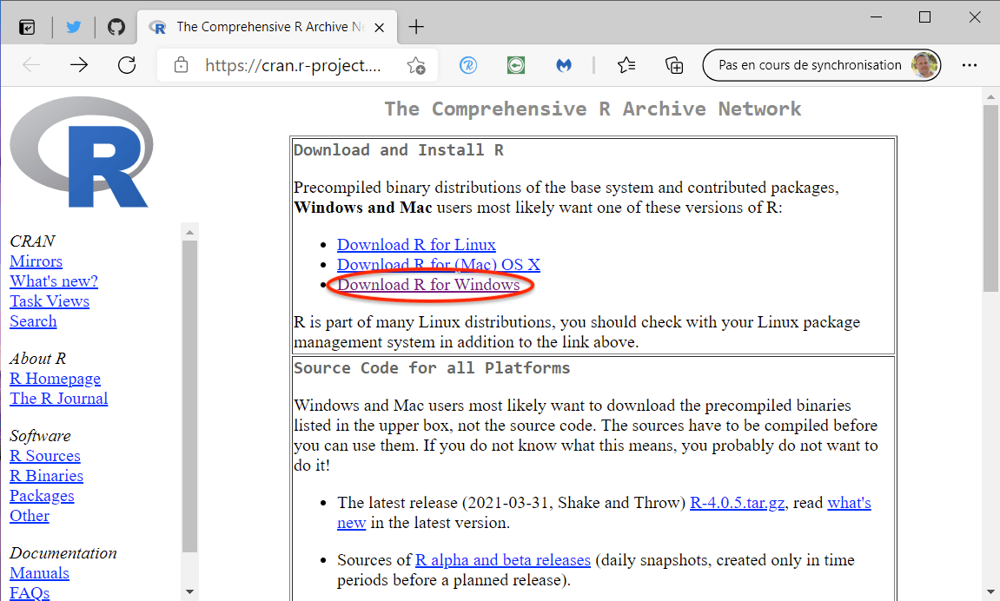

Naviguez vers le site [\<http://cran.r-project.org\>](http://cran.r-project.org){.uri}. Ensuite allez dans la section **Download R for Windows**, et puis dans la section **base** à la page suivante.

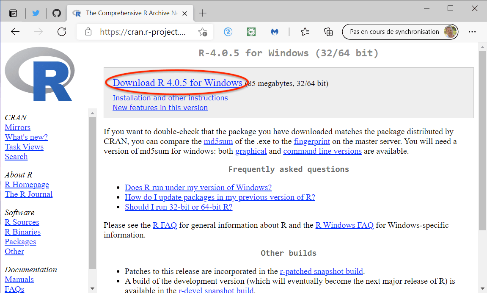

Vous téléchargez la dernière version de R (ici **Download R 4.0.5 for Windows**).

Lancez cet installeur `R-4.0.5-win.exe` une fois qu'il est téléchargé. Autorisez l'application à s'installer (*vous devez avoir des droits administrateurs sur le PC pour pouvoir le faire*).

::: {.center data-latex=""}
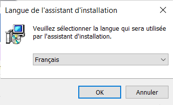{width="50%"}
:::

Sélectionnez le français pour l'installation.

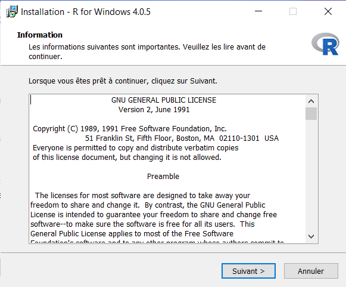

Acceptez la licence en cliquant sur le bouton `<Suivant>`.

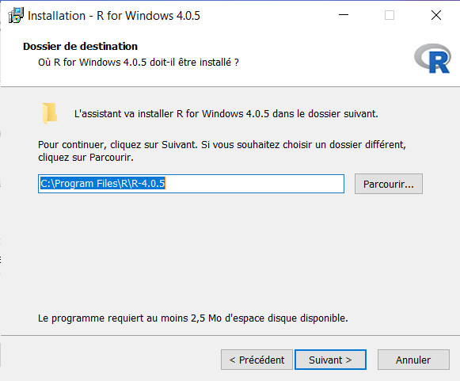

Conservez le dossier proposé par défaut pour l'installation de R et cliquez sur `<Suivant>`.

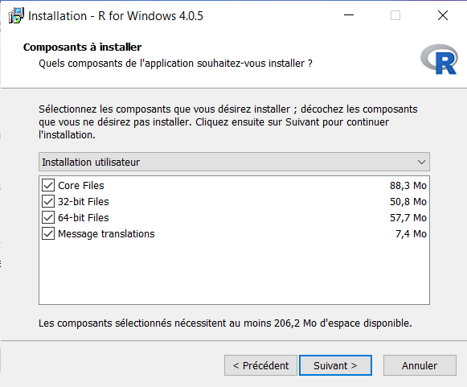

Conservez également tous les composants proposés dans l'étape suivante et cliquez sur `<Suivant>`.

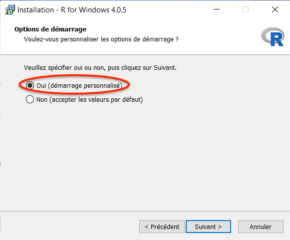

Attention : à l'étape **Options de démarrage**, vous sélectionnez **oui (démarrage personnalisé)**, puis `<Suivant>`.

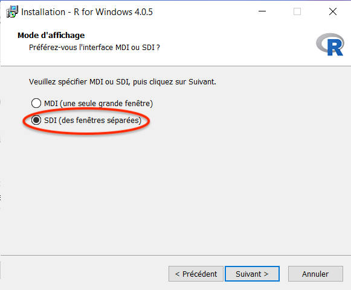

Dans la section **Mode d'affichage**, il est important de modifier la valeur qui est MDI par défaut. Vous allez sélectionner **SDI (des fenêtres séparées)**, puis `<Suivant>`.

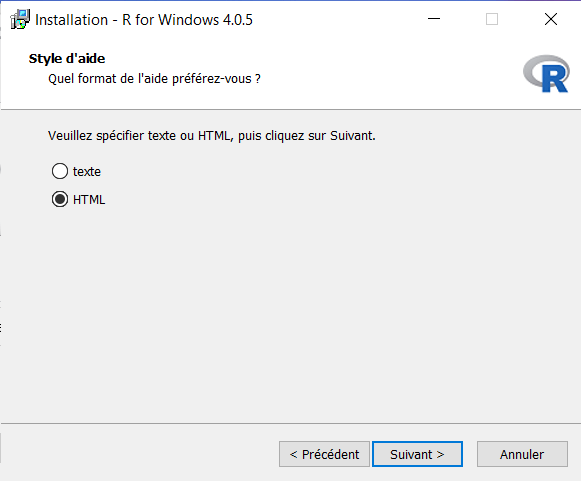

Dans l'écran **Style d'aide**, vous pouvez laisser **HTML**, cliquez `<Suivant>`.

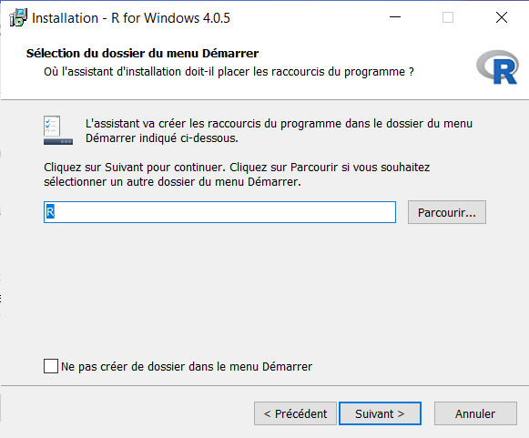

Laissez la valeur par défaut pour la sélection du dossier du menu Démarrer, puis `<Suivant>`.

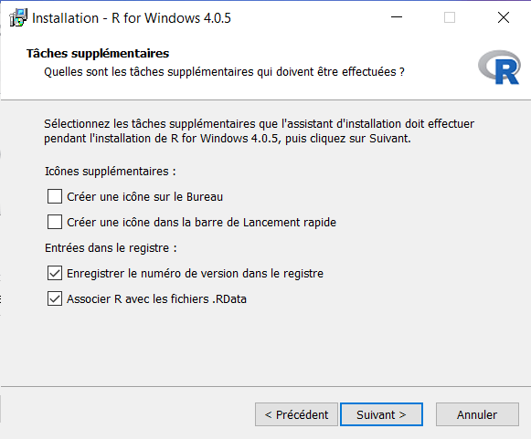

De même pour **Tâches supplémentaires**, les options par défaut conviennent. Vous pouvez éventuellement cocher l'item "Créer une icône sur le Bureau" et/ou "Créer une icône dans la barre de Lancement rapide". Cliquez `<Suivant>`.

R s'installe... À la fin, quittez l'installeur en cliquant sur le bouton `<Terminer>`.

\newpage

# Lancement et configuration de R

Allez dans le menu Démarrer et repérez l'entrée `R x64 4.0.5` dans le dossier `R`. Lancez-le. S'il n'y a que `R i386 4.0.5` ou si le premier ne fonctionne pas, vous avez peut-être un Windows 32bit. Utilisez alors `R i386 4.0.5` dorénavant. R démarre et vous obtenez ceci :

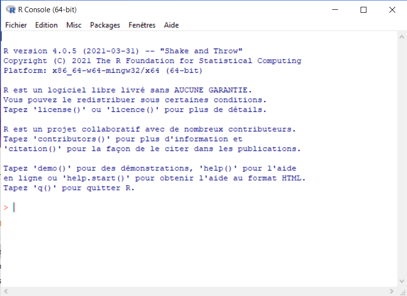

Si l'apparence est différente, vous n'avez peut-être pas sélectionné l'option **SDI** à l'installation ?

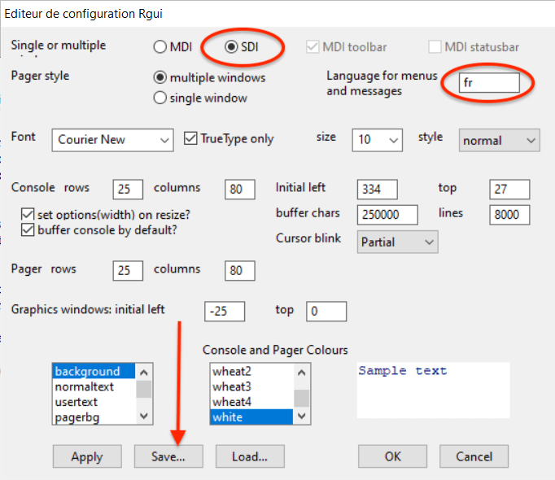

Vous pouvez changer la configuration de R à ce stade à partir du menu `Edition -> Préférences`, sélectionnez l'option **SDI**. De même, si les menus n'apparaissent pas en français, vous pouvez indiquer **fr** dans **Language for menus and messages**.

Si vous effectuez des modifications dans cet éditeur de configuration Rgui, assurez-vous de cliquer ensuite sur le bouton `<Save...>` et d'enregistrer sous le nom et dans le dossier proposé par défaut. Si vous ne le faites pas, vos modifications seront perdues au redémarrage de R !

Cliquez ensuite sur `<OK>`. Si une boite de dialogue indique que R doit être redémarré, quittez R et redémarrez-le maintenant. S'il vous demande de sauver une image de la session, cliquez `<Oui>`. Vérifiez que l'interface est correcte et que les menus sont en français.

\newpage

# Installation de R Commander

Dans la console R, entrez l'instruction `install.packages("Rcmdr")`et validez avec la touche `<entrée>`. Respectez bien les majuscules et minuscules (`R` majuscule et `cmdr` en minuscules).


::: {.center data-latex=""}
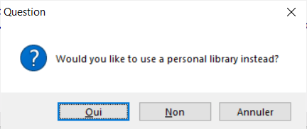{width="62%"}
:::

R ne peut à ce stade enregistrer les nouveaux packages dans le dossier système. Il vous propose d'utiliser une bibliothèque personnelle. Cliquez sur le bouton `<Oui>`. Ensuite, acceptez l'emplacement proposé par défaut et cliquez une seconde fois sur `<Oui>`.

R vous demande ensuite depuis quel serveur ("Secure CRAN mirrors") vous désirez récupérer les packages. Vous pouvez conserver le serveur **0-Cloud** proposé en première position. Cliquez `<OK>`.

::: {.center data-latex=""}
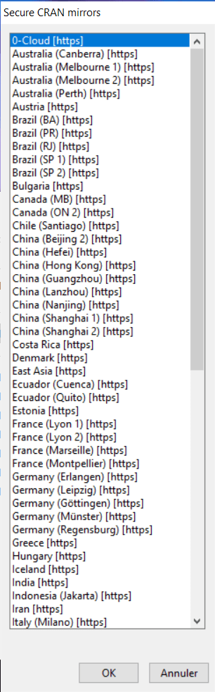

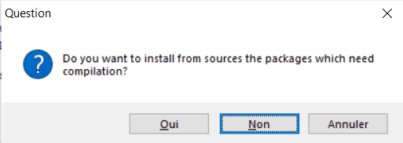{width="73%"}
:::

Attendez que R télécharge et installe tous les packages nécessaires. Cela peut prendre un certain temps. Si R semble bloqué, attendez qu'il rende la main et réessayez. Si cela ne fonctionne toujours pas, redémarrez R et essayez un autre serveur. Si R vous demande d'installer certains packages depuis les sources, cliquez `<Non>`.

# Finalisation de l'installation de R Commander

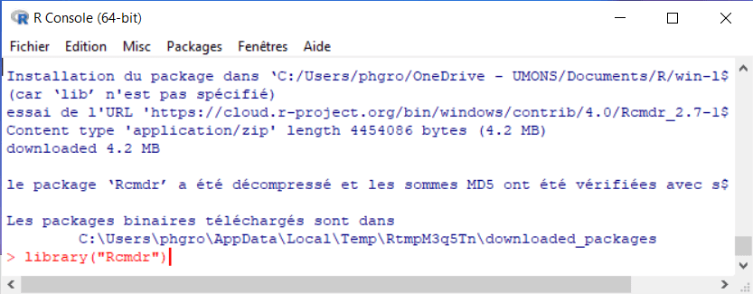

Une fois l'installation terminée, entrez `library("Rcmdr")` orthographié exactement comme cela (attention encore une fois aux majuscules et minuscules) et puis tapez sur la touche `<entrée>`.

::: {.center data-latex=""}
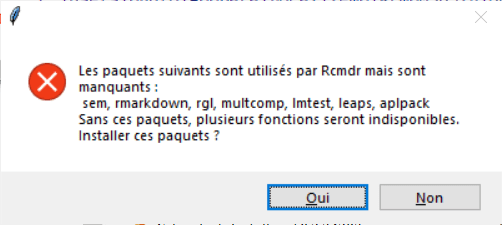{width="72%"}
:::

Encore d'autres packages sont proposés à l'installation. Cliquez `<Oui>`.

::: {.center data-latex=""}
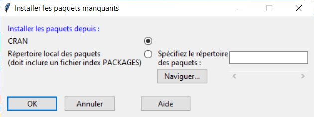{width="90%"}
:::

Dans la boite de dialogue **Installer les paquets manquants**, ne changez rien par rapport aux options par défaut et cliquez `<OK>`.

Encore une fois, laissez l'installation se faire. S'il vous est demandé une seconde fois d'installer des packages depuis les sources, cliquez à nouveau sur `<Non>`. Lorsque tous les packages additionnels sont téléchargés et installés, la fenêtre principale de R Commander apparaît pour la première fois.

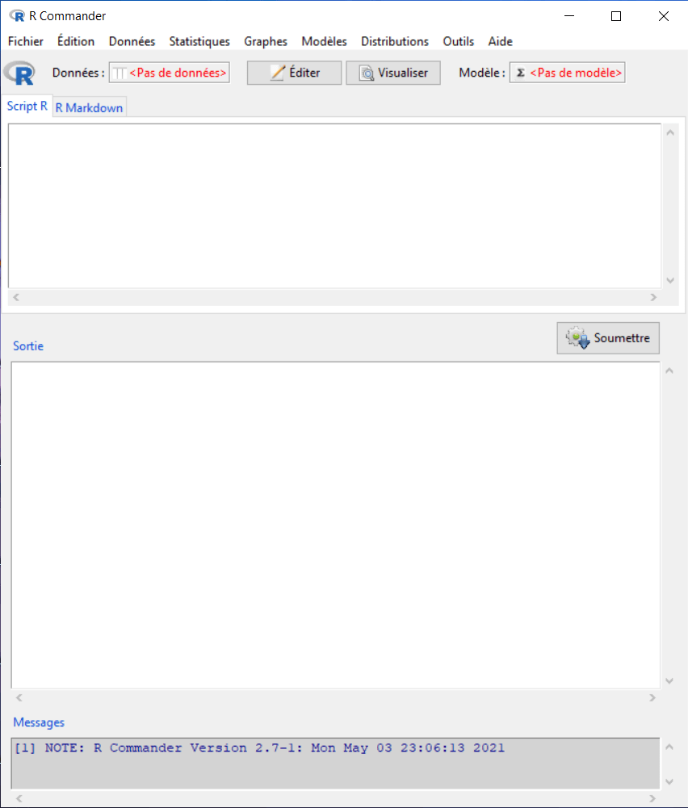

L'installation est terminée. Dans cette fenêtre, vous pouvez aller dans le menu `Fichier -> Sortir -> Fermer Commander et R`, et vous cliquez le bouton `<OK>` aux diverses questions qui vons sont posées ensuite.

\newpage

# Démarrage de R Commander

Le plus simple pour votre utilisation routinière de R Commander est de lancer d'abord R comme vous l'avez fait plus haut (vous pouvez épingler le programme dans la barre des tâches pour un accès plus rapide), et ensuite d'entrer l'instruction `library("Rcmdr")` et `<entrée>` pour lancer R Commander depuis R. Vous êtes maintenant prêt à travailler.

------------------------------------------------------------------------
