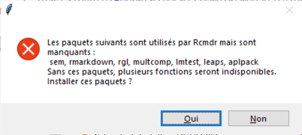

```{r setup, include=FALSE}
knitr::opts_chunk$set(echo = TRUE)
```

# Introduction

Ce tutoriel explique pas à pas comment installer R version 4.0.5 et R Commander version 2.7-1 (les dernières versions de ces logiciels au 2021-05-03) sous Windows 10 ou sous MacOS. À la fin de ce document une brève explication est donnée pour l'installation sous Linux. La première partie détaille la procédure sous Windows, la seconde partie est consacrée à MacOS.

Assurez-vous d'avoir un PC suffisamment puissant. Évitez les chromebooks, les ordinateurs dédiés à du travail léger, ou trop vieux (plus ancien que 3 ou 4 ans). Un ordinateur muni d'un processeur Core i3, i5, i7 ou i9 de 6^ème^ génération ou plus, de minimum 4Go de mémoire vive (si possible 8Go), d'un disque dur rapide d'au moins 256Go, et d'un écran de 1920x1080 minimum devrait convenir. Les nouveaux Macs à puce M1 conviennent également. Vous devez aussi avoir les droits administrateurs pour pouvoir y installer des logiciels et au moins 25 à 30Go de libre sur le disque dur principal.

*Ce document est une contribution à [STAT for U](https://github.com/STATforU).*


# Installation sous Windows 10

Sur un PC équipé de Windows 10, vous allez installer R, le lancer et ensuite installer les packages R supplémentaires nécessaires pour faire fonctionner R Commander.

## Installation de R

Naviguez vers le site http://cran.r-project.org. Ensuite allez dans la section **Download R for Windows**, et puis **base**.


Vous téléchargez la dernière version de R (**Download R 4.0.5 for Windows** début mai 2021).


Lancez cet installeur `R-4.0.5-win.exe` une fois qu'il est téléchargé. Autorisez l'application à s'installer (*vous devez avoir des droits administrateurs sur le PC pour pouvoir le faire*). Sélectionnez le français pour l'installation.


Acceptez la licence en cliquant sur le bouton `<Suivant>`.


Conservez le dossier proposé par défaut pour l'installation de R et cliquez sur `<Suivant>`.


Conservez également tous les composants proposés dans l'étape suivante et cliquez sur `<Suivant>`.


Attention\ : à l'étape **Options de démarrage**, vous sélectionnez **oui (démarrage personnalisé)**, puis `<Suivant>`.


Dans la section **Mode d'affichage**, il est important de modifier la valeur qui est MDI par défaut. Vous allez sélectionner **SDI (des fenêtres séparées)**, puis `<Suivant>`.


Pour l'écrans suivants (Style d'aide), vous pouvez laisser **HTML**, faites `<Suivant>`.


Laissez la valeur par défaut pour la sélection du dossier du menu Démarrer, puis `<Suivant>`.


De même pour **Tâches supplémentaires**, les options par défaut conviennent. Vous pouvez éventuellement cocher l'item "Créer une icône sur le Bureau" et/ou "Créer une icône dans la barre de Lancement rapide". Cliquez `<Suivant>`.


R s'installe... À la fin, quittez l'installeur en cliquant sur le bouton `<Terminer>`.

## Lancement et configuration de R

Allez dans le menu Démarrer et repérez l'entrée `R x64 4.0.5` dans le dossier `R`. Lancez-le. S'il n'y a que `R i386 4.0.5` ou si le premier ne fonctionne pas, vous avez peut-être un Windows 32bit. Utilisez alors `R i386 4.0.5` dorénavant. R démarre et vous obtenez ceci\ :


Si l'apparence est différente, vous n'avez peut-être pas sélectionné l'option **SDI** à l'installation\ ? Vous pouvez le changer à ce stade à partir du menu `Edition -> Préférences`, sélectionnez l'option **SDI**. De même, si les menus n'apparaissent pas en français, vous pouvez indiquer **fr** dans "Language for menus and messages".


Si vous effectuez des modifications dans cet éditeur de configuration Rgui, assurez-vous de cliquer ensuite sur le bouton `<Save...>` et d'enregistrer sous le nom et dans le dossier proposé par défaut. Si vous ne le faites pas, vos modifications seront perdues au redémarrage de R\ !

Cliquez ensuite sur `<OK>`. Si une boite de dialogue indique que R doit être redémarré, quittez R et redémarrez-le maintenant. S'il vous demande de sauver une image de la session, cliquez `<Oui>`. Vérifiez que l'interface est correcte et que les menus sont en français.

## Installation de R Commander

Dans la console R, entrez l'instruction `install.packages("Rcmdr")`et validez avec la touche `<entrée>`. Respectez bien les majuscules et minuscules (`R` majuscule et `cmdr` en minuscules).


R ne peut à ce stade enregistrer les nouveaux packages dans le dossier système. Il vous propose d'utiliser une bibliothèque personnelle. Cliquez sur le bouton `<Oui>`. Ensuite, acceptez l'emplacement proposé par défaut et cliquez une seconde fois sur `<Oui>`. 


R vous demande ensuite depuis quel serveur ("Secure CRAN mirrors") vous désirez récupérer les packages. Vous pouvez conserver le serveur **0-Cloud** proposé en première position. Cliquez `<OK>`.


Attendez que R télécharge et installe tous les packages nécessaires. Cela peut prendre un certain temps. Si R semble bloqué, attendez qu'il rende la main et réessayez. Si cela ne fonctionne toujours pas, redémarrez R et essayez un autre serveur. Si R vous demande d'installer certains packages depuis les sources, cliquez `<Non>`.


## Premier lancement de R Commander et finalisation de l'installation

Une fois l'installation terminée, entrez `library("Rcmdr")` orthographié exactement comme cela (attention encore une fois aux majuscules et minuscules) et puis tapez sur la touche `<entrée>`.


Encore d'autre packages sont proposés à l'installation. Cliquez `<Oui>`.



Dans la boite de dialogue "Installer les paquets manquants", ne changez rien par rapport aux options par défaut et cliquez `<OK>`.


Encore une fois, laissez l'installation se faire. S'il vous est demandé une seconde fois d'installer des packages depuis les sources, cliquez à nouveau sur `<Non>`. Lorsque tous les packages additionnels sont téléchargés et installés, la fenêtre principale de R Commander apparaît pour la première fois.


L'installation est terminée. Dans cette fenêtre, vous pouvez aller dans le menu `Fichier -> Sortir -> Fermer Commander et R`, et vous cliquez le bouton `<OK>` aux diverses questions qui vons sont posées ensuite.

## Démarrage de R Commander

Le plus simple pour votre utilisation routinière de R Commander est de lancer d'abord R comme vous l'avez fait plus haut (vous pouvez épingler le programme dans la barre des tâches pour un accès plus rapide), et ensuite d'entrer l'instruction `library("Rcmdr")` et `<entrée>` pour lancer R Commander depuis R. Vous être maintenant prêt à travailler.

---------

# Installation sous MacOS

À partir d'un Mac ayant une version récente de son système d'exploitation (c'est-à-dire, Big Sur ou Catalina), nous allons d'abord installer R. Il nous faudra aussi XQuartz. Ensuite, nous installerons les packages R supplémentaires pour R Commander. Enfin, nous passerons en revue trois façons de lancer R Commander et quelques détails complémentaires pour que R Commander fonctionne de manière fluide sur votre Mac.

## Installation de R

Allez sur le site https://cran.r-project.org, dans la section **Download R for (Mac) OS X**.


Téléchargez le fichier **R-4.0.5.pkg** (ou la dernière version en date de R).


Ce fichier est un installeur qui place R et ses dépendances automatiquement pour vous sur votre Mac. Double-cliquez dessus et suivez les instruction...

## Installation de XQuartz

Téléchargez [XQuartz](https://www.xquartz.org) et lancez sont installeur. Il s'agit d'un logiciel qui permet d'afficher des fenêtres de type X11 que R Commander utilise. Vous verrez d'ailleurs que ses fenêtres ont une icône "X" et ont un look qui diffère sensiblement du look des fenêtres Mac classiques.


## Lancement de R et installation de R Commander

À présent, lancez R. Allez dans le dossier **Applications**, repérez l'entrée **R** qui y a été rajoutée et double-cliquez dessus.


La fenêtre principale de R apparaît. Tapez `install.packages("Rcmdr")` et puis appuyez sur la touche `<entrée>`. Attention aux majuscules et minuscules... c'est bien `R` majuscule suivi de `cmdr` en minuscules.


R vous demande depuis quel serveur vous voulez récupérer les fichiers. Vous pouvez sélectionner la première entrée (**0-Cloud**).


R installe toute une série d'"addins" supplémentaires que l'on nomme "packages" dans la terminologie R. Laissez-le travailler...


## Premier lancement de R Commander et finalisation de l'installation

Une fois l'installation terminée, entrez `library("Rcmdr")` orthographié exactement comme cela (attention encore une fois aux majuscules et minuscules) et puis tapez sur la touche `<entrée>`. 


R Commander démarre pour la première fois. *Notez que, selon la configuration de votre ordinateur, les messages s'affichent dans une langue ou une autre (anglais ou français, par exemple). Nous forcerons le lancement de R Commander en français un peu plus loin.* Le programme détectera probablement que d'autres packages sont encore à installer. Cliquez sur le bouton `<Yes>` ou `<Oui>`.


Dans la boite de dialogue suivante, laissez les options par défaut et cliquez sur le bouton `<OK>`.


Les autres packages s'installent, et puis au bout d'un moment, la fenêtre principale de R Commander apparaît pour la première fois. Pour forcer R Commander à utiliser le français (si nécessaire), vous pouvez utiliser l'instruction suivante\ : `Sys.setenv(LANGUAGE = "fr"); library("Rcmdr")`.


La fenêtre principale de R Commander se présente comme suit\ :


Pour éviter les temps de latence erratiques dans R Commander, vous devez désactiver la fonction "app nap" de MacOS pour R. Allez dans le menu en haut de la fenêtre de R Commander et sélectionnez le menu `Outils -> Gestion de Mac OS X nap pour R.app...`. Sélectionnez l'option "désactivé" dans la boite de dialogue et cliquez sur le bouton `<OK>`.


L'installation de R Commander est terminez. Quittez maintenant R Commander et R en allant sélectionner dans le menu `Fichier -> Sortir -> Fermer Commander et R`. Aux questions posées, répondez `<OK>`.

## Démarrage de R Commander

Il existe plusieurs façons de démarrer R Commander sous MacOS. Choisissez celle que vous préférez\ !

### Démarrage depuis R.app

Vous pouvez continuer à lancer R depuis son icône dans le menu **Applications**, et R Commander ensuite via la commande `Sys.setenv(LANGUAGE = "fr"); library("Rcmdr")` dans R. R enregistre un historique des commandes par défaut. Lorsque vous lancez R, vous pouvez les récupérer avec les flèches `<Haut>` et `<Bas>`. Ainsi, il ne faut pas se remémorer la commande à chaque lancement.

### Démarrage depuis le terminal

Lancez le terminal MacOS qui se trouve dans le sous-dossier **Utilities** du dossier **Applications**. Il est cependant plus simple de le démarrer depuis Spotlight, l'utilitaire de recherche du Mac. Lancez Spotlight soit en cliquant sur l'icône loupe en haut à droite dans la barre de menu du Mac, soit via le raccourci `<Cmd> + <Espace>`. Tapez ensuite "terminal" dans la fenêtre qui apparaît sans les guillements. Enfin, cliquez sur l'entrée relative à l'application "Terminal" (en principe elle apparaît dans la section **TOP HIT**). Cette application a une icône qui représente une fenêtre noire avec un "prompt" blanc en forme de ">_" en haut à gauche.


Dans le terminal, entrez l'instruction suivante\ : \
`export LC_ALL=fr_FR.UTF-8 &&`\
`export R_DEFAULT_PACKAGES='methods,datasets,utils,grDevices,graphics,stats,Rcmdr' &&`\
`R -q --interactive` sur une seule ligne, et tapez ensuite sur la touche `<entrée>`.


R Commander doit se lancer en français. Pas question, évidemment, de retenir cette commande par cœur, mais ici aussi, l'historique des commandes est accessible avec la touche flèche `<Haut>` pour récupérer la version précédente à chaque fois que vous lancer le terminal.

### Application de démarrage spécifique

Autant dans R.app que dans le Terminal, les commandes à rentrer sont un peu pénibles. J'ai créé une petite application spécifique pour lancer *directement* R Commander en français depuis le dossier **Applications**.

Cette petite application est à charger depuis https://go.sciviews.org/rcmdr-mac. Vous dézippez le fichier `R Commander (fr).zip` téléchargé, et ensuite, vous déplacez `R Commander (fr)` dans le dossier **Applications** (ou sur le bureau si vous préférez).

La première fois que vous lancez cette application `R Commander (fr)`, vous verrez ceci\ :


Ce message s'affiche parce que l'application n'est **pas** "notarisée" (vous devez passer par une procédure fastidieuse et payante chez Apple pour qu'ils certifient que votre application est sûre, et ... non, je ne l'ai pas fait). Il est toutefois possible d'en forcer le démarrage en cliquant bouton droit dessus et en sélectionnant l'entrée `Open` ou `Ouvrir` **tout en appuyant simultanément sur la touche `<Option>`**. Vous devez alors voir la boite de dialogue suivante où vous pouvez cliquer sur le bouton `<Open>`.


Enfin, dernière étape, vous devez autoriser l'application à contrôler le terminal en cliquant sur le bouton `<OK>` dans la boite de dialogue qui apparaît ensuite.


La fenêtre principale de R commander doit apparaître au bout d'un court laps de temps. À partir de ce moment-là, vous pouvez utiliser l'application `R Commander (fr)` directement normalement comme pour toute autre application en double-cliquant dessus.

# Note pour les utilisateurs de Linux

R et R Commander s'installent très bien sous Linux également, mais les procédures diffèrent d'une distribution à l'autre. Veuillez consulter le document officiel d'[installation de R Commander](https://socialsciences.mcmaster.ca/jfox/Misc/Rcmdr/installation-notes.html).
