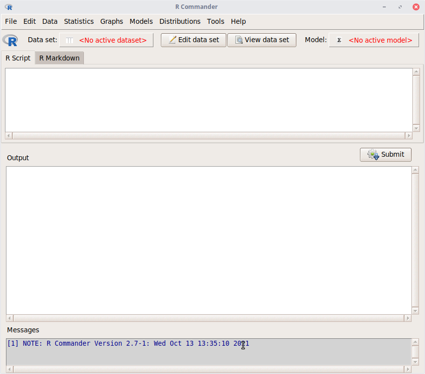
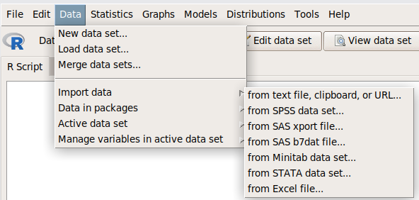
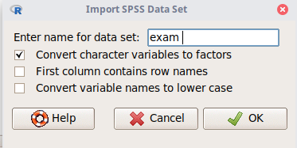
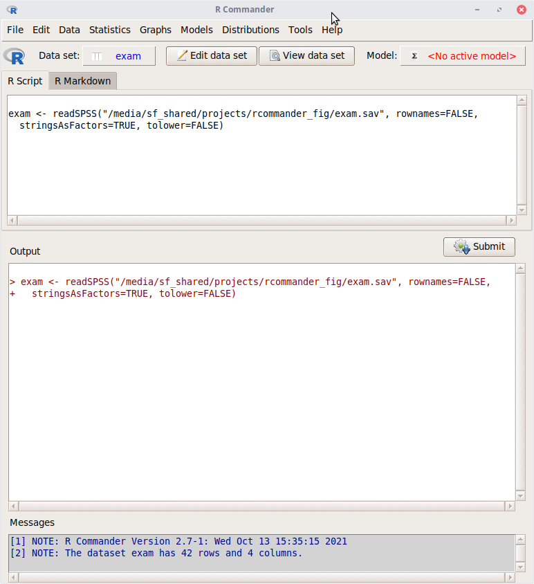
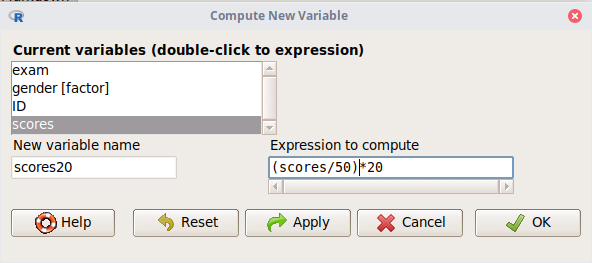
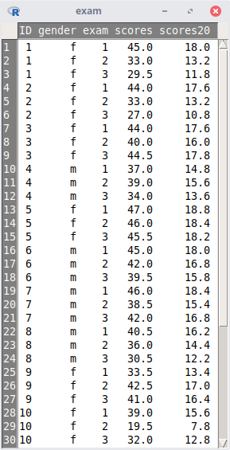
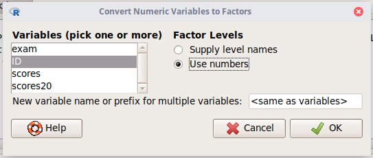
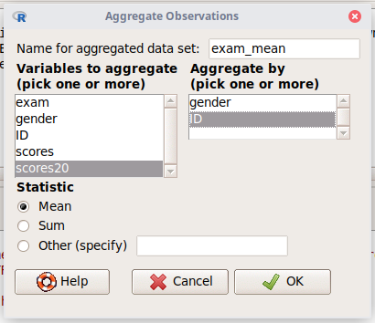
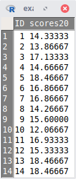
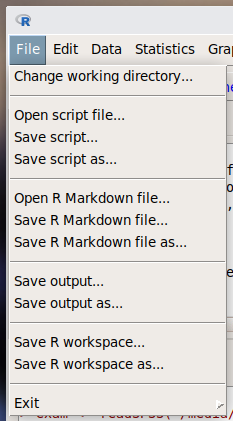

```{r setup, include=FALSE}
knitr::opts_chunk$set(echo = TRUE, fig.align = "center")
```


\vspace{12cm}

------------------------------------------------------------------------

::: {.center data-latex=""}
*Ce document est une contribution à [STAT for U](https://github.com/STATforU).*


:::

\newpage

# Interface de R Commander

L'interface de R Commander se divise en quatre grandes parties. 

1. les menus et sous-menus
2.  `R Script` (ou `R Markdown`) : la section qui va contenir l'ensemble des instructions utilisées
3. `Output` : les résultats liés aux instructions utilisées
4. `Messages` : les messages associés aux instructions utilisées

::: {.center data-latex=""}


:::

L'un des grands avantages de R Commander est de pouvoir garder l'ensemble des instructions réalisées sur un tableau de données afin d'avoir une analyse reproductible. 

\newpage

# Importation de données

L'onglet `Data` comprend une série de sous-menus qui permettent d'importer et de remanier des données. 

Les données sont disponibles dans de nombreux formats. Elles peuvent provenir d'un fichier au format varié (.txt, .xls,.sav,...) ou même d'un package R (une sorte de boite à outils qui comprend des fonctions qu'on utilise dans R et des jeux de données).

Nous utiliserons le tableau de données exam.sav (que vous pouvez télécharger [ici](https://github.com/STATforU/course-r_commander/tree/main/seance_2/datasets)). Afin d'importer ce tableau de données, nous allons naviguer dans les menus : `Data` -> `Import Data` -> `From SPSS data set...`.

::: {.center data-latex=""}


:::

Nous allons nommer ce tableau par des données. Ce nom sera le nom de notre tableau de données dans R Commander. Différentes options sont disponibles afin de personnaliser l'importation des données. 

::: {.center data-latex=""}


:::

Le tableau de données `exam` est importé avec succès. Ce tableau est le tableau de données actif. Il est possible d'éditer le tableau et de le visualiser (`Edit data set` ou `View dataset`). L'instruction R utilisée afin d'importer les données se trouve dans la section `R Script`. La section message nous informe sur le nombre de colonnes et de lignes du tableau.

::: {.center data-latex=""}


:::


Les étudiants ont passé 3 examens (variable `exam`) et ont obtenu une note sur 50 (variable `scores`). 

\newpage

# Remaniement des données

Les sous-menus `Active data set` et `Manage variables in active data set` sont dédiés à la manipulation sur le tableau de données. Le premier menu va s'intéresser à l'ensemble du tableau de données alors que le second va traiter une variable en particulier (une colonne du tableau est une variable dans R). 

`Active data set` comprend les instructions afin de trier un tableau, de filtrer ou encore d'agréger un tableau. `Manage variables in active data set` permet de renommer une variable, de calculer une nouvelle variable, de changer le type de la variable (R est sensible au type de la variable)

La note des étudiants est sur 50. Nous voudrions l'avoir sur 20. Nous naviguons dans les menus afin de calculer cette nouvelle variable (`Data` -> `Manage variables in active data set` -> `Compute new variable...`).

La boite de dialogue nous propose de nommer notre nouvelle variable (`New variable name`) et d'écrire le calcul associé à cette variable (`Expression to compute`).

::: {.center data-latex=""}


:::

Le tableau de données s'adapte en temps réel afin de visualiser les modifications réalisées.

::: {.center data-latex=""}


:::

Les étudiants ont réalisé 3 examens. Nous voudrions avoir une note moyenne par étudiant. La variable ID correspond à l'identifiant des étudiants (un nombre dans ce tableau). Nous convertissons ces valeurs numériques en valeurs facteurs (en facteur, nous précisions explicitement que les 3 premières lignes du tableau correspondent au même étudiant). 

La suite d'instruction est la suivante : `Data` -> `Manage variables in active data set` -> `Convert numeric variables to factors...`. À nouveau, nous pouvons choisir le nom de cette nouvelle variable et de définir les niveaux de cette variable.

::: {.center data-latex=""}


:::

L'agrégation va modifier l'ensemble du tableau, il faut donc changer de menu (`Active data set` -> `Aggregate variables in active data set...` ). Nous avons la possibilité de donner un nom à ce tableau résumé, de choisir les variables d'intérêt et la formule mathématique utilisée pour agréger les observations.


::: {.center data-latex=""}


:::

Un nouveau tableau est disponible avec la note moyenne par étudiant.

::: {.center data-latex=""}


:::

\newpage

# Sauvegarde du script R

Afin d'être reproductible, il est important de sauver l'ensemble des instructions que nous avons réalisés sur un tableau de données.

Dans l'onglet file, il est possible de sauvegarder notre script R (`File` -> `Save script...`)

::: {.center data-latex=""}


:::

\newpage

# Exercices supplémentaires

Entrainez-vous sur 2 jeux de données supplémentaires. 

## Les pétales d'iris

- Importez le tableau de données `iris` provenant du package datasets (consultez la page d'aide afin d'en apprendre davantage sur ces données).
- Visualisez le tableau de données
- Triez le tableau de données en fonction de la longueur des pétales par ordre décroissant.
- Calculez le ratio de la longueur des Pétales (`Petal.Length`) par la longueur de Sépales (`Sepal.Length`). Nommez cette variable `ratio`.
- Calculez la moyenne par espèces de la variable `ratio`.

Vous devriez obtenir un tableau similaire à ce dernier

| Species    | ratio |
|------------|-------|
| setosa     | 0.29  |
| versicolor | 0.72  |
| virginica  | 0.84  |

##  La note des étudiants aux examens

- Importez le tableau de données `exam.txt` (disponible [ici](https://github.com/STATforU/course-r_commander/tree/main/seance_2/datasets)). Il s'agit du même tableau que nous avons traité précédemment.
- Intéressez-vous uniquement au garçon et déterminez quel est l'étudiant qui a eu la note moyenne sur ces 3 examens la plus faible.


