```{r setup, include=FALSE}
knitr::opts_chunk$set(echo = TRUE, fig.align = "center")
```


\vspace{12cm}

------------------------------------------------------------------------

::: {.center data-latex=""}
*Ce document est une contribution à [STAT for U](https://github.com/STATforU).*


:::

\newpage

# Se préparer...

Démarrez R Commander et chargez le jeu de données `ToothGrowth` que nous utiliserons pour les exercices de visualisation et tests d'hypothèses. Ce jeu de données est distribué avec le paquet {datasets} dans R. Vous devez donc faire `Données` -> `Données dans les paquets` -> `Lire des données depuis un paquet attaché...`. Tant que vous êtes dans cette boite de dialogue, affichez le fichier d'aide associé à ce jeu de données pour le découvrir. Ensuite, ouvrez le jeu de données (bouton **OK**).

::: {.center data-latex=""}
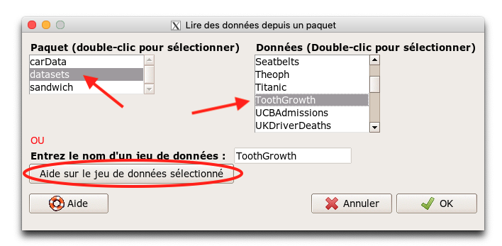
:::

Comme précédemment, nous nous concentrerons sur la logique propre à R Commander, sachant que les différents graphiques et tests répondent tous à cette même logique à peu de choses près. Vous pourrez ensuite explorer par vous-mêmes les différentes possibilités du logiciel à travers ses différentes entrées de menus par vous-même plus tard.

**Visualisez** le tableau de données et lisez l'aide en ligne pour comprendre à quoi ces correspondent. Il s'agit de mesurer l'effet de la vitamine C seule, ou dans du jus d'orange sur la croissance des dents chez le cochon d'Inde (plus précisément sur les odontoblastes qui sont les cellules responsable de cette croissance, mais cette précision n'est pas cruciale pour la suite).

# Visualisation des données

La description des données est la première étape à réaliser, avant toute étude statistique. Cette description peut être numérique (calculer des moyennes ou des écarts types, par exemple, voir séance n°2), mais elle peut aussi être visuelle à l'aide de graphiques.

## Allongement en fonction de la dose de vitamine C

Nous allons réaliser un graphique de l'allongement des dents en fonction de la dose en vitamine C. Allez dans le menu `Graphes` -> `Nuage de points`. Sélectionnez `dose` comme variable x, et `len` comme variable y, puis cliquez sur le bouton **OK**.

::: {.center data-latex=""}
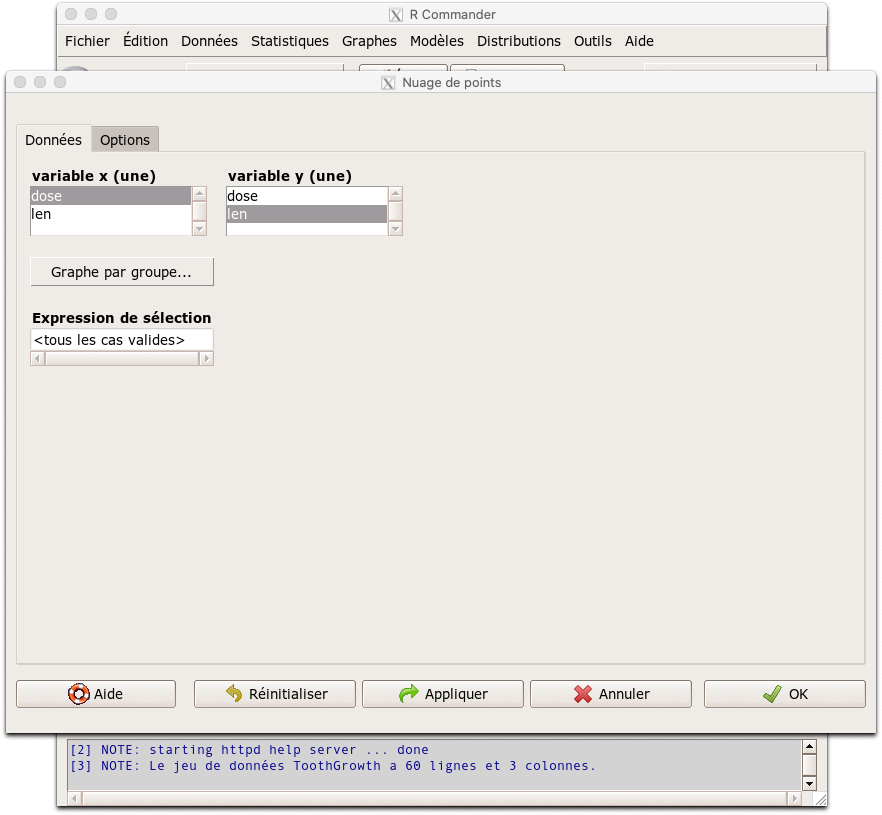
:::

Vous devez obtenir le graphique suivant\ :

::: {.center data-latex=""}
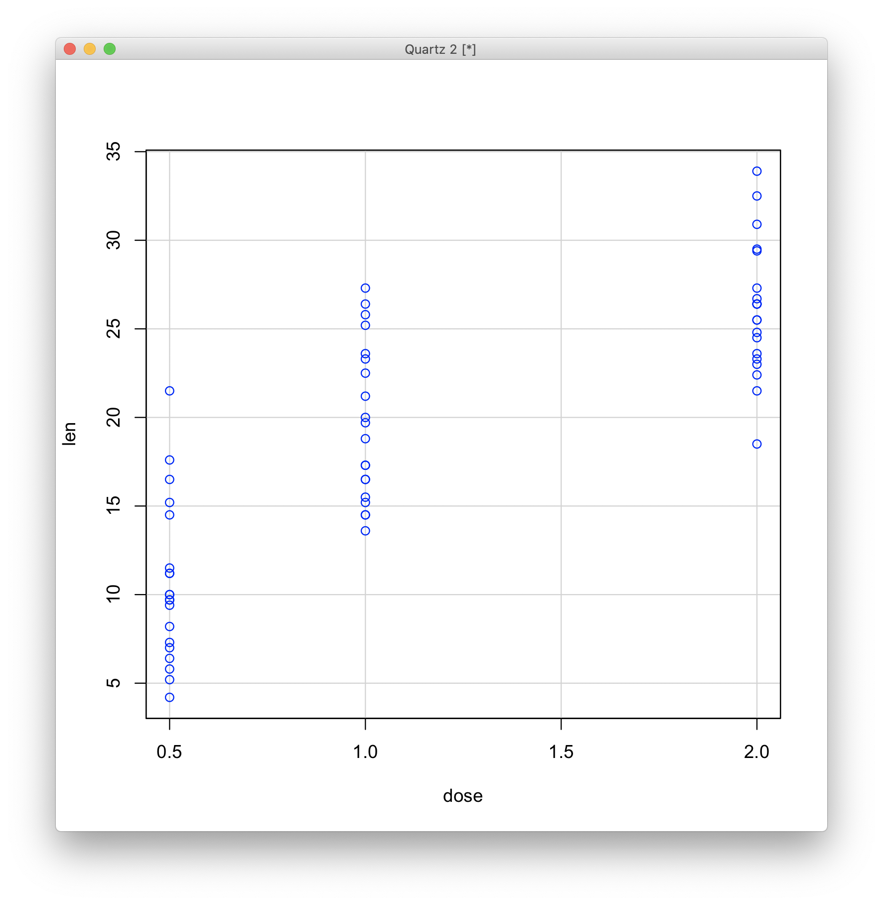
:::

Ce graphique n'est pas transcendant, mais il donne déjà une bonne idée de la distribution des données. Heureusement, R Commander propose une série d'options supplémentaires pour l'améliorer. La toute première chose à faire est de distinguer les points relatifs aux deux traitements, vitamine C seule ou jus d'orange. Recréez le graphique, mais cette fois-ci, cliquez sur le bouton **Graphe par groupe...**.

::: {.center data-latex=""}
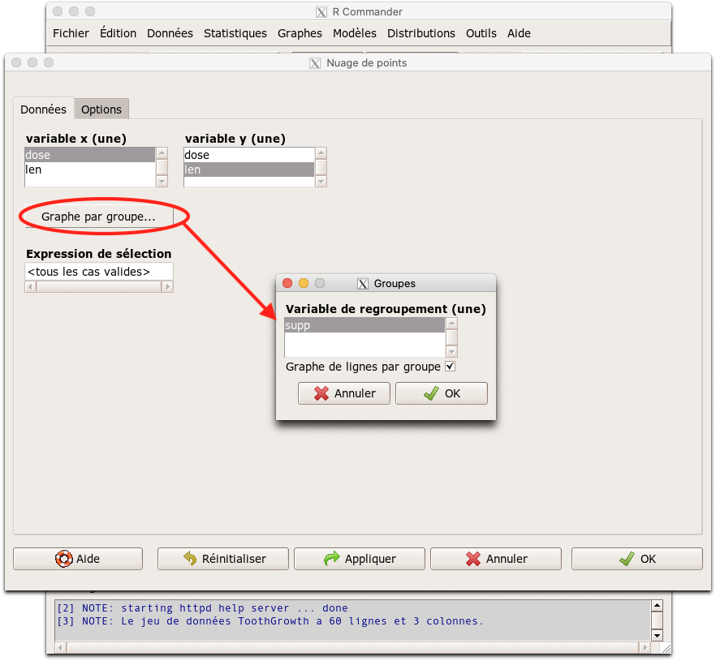
:::

Comme il n'y a qu'une seule variable de type `factor`, qui est `supp`, cette dernière variable est directement sélectionnée. Acceptez cette configuration. Vous obtenez le graphique suivant\ :

::: {.center data-latex=""}
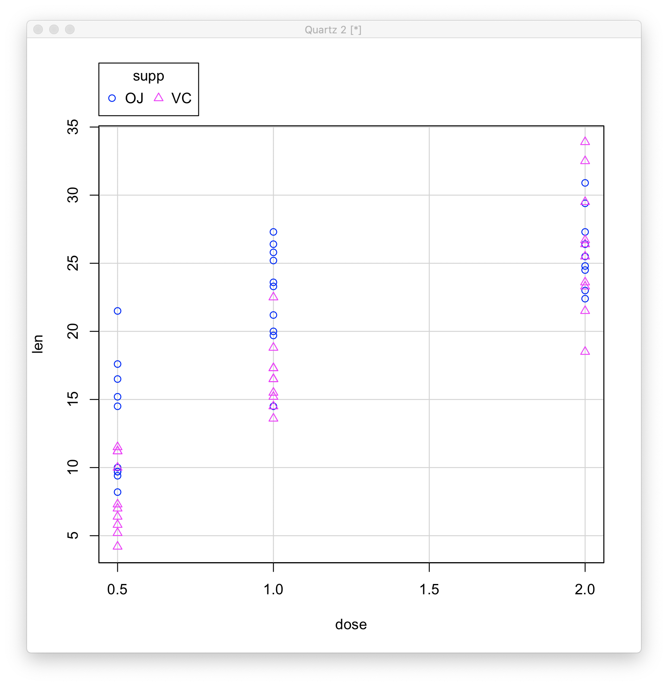
:::

C'est mieux, mais ce n'est pas encore parfait. Relancez la commande et explorez les différentes options (onglet **Options**) pour améliorer ce graphique et tentez de réaliser par vous-même la version suivante\ :

::: {.center data-latex=""}
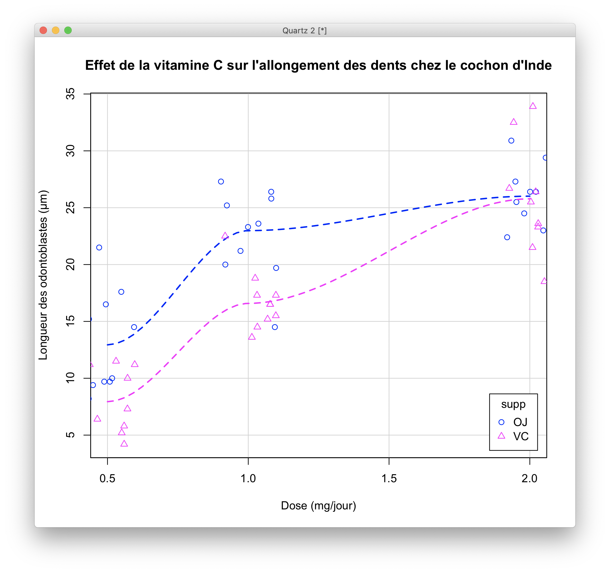
:::

## Autres graphiques

Bon, maintenant, nous avons d'autres graphiques à disposition. Pour ces données, nous pouvons aussi utiliser le `Graphe XY conditionnel`, en choisissant `dose` comme variable explicative, `len` comme variable réponse et `supp` comme variable de condition. Cela donne ceci (graphique améliorable via les options, bien sûr)\ :

::: {.center data-latex=""}
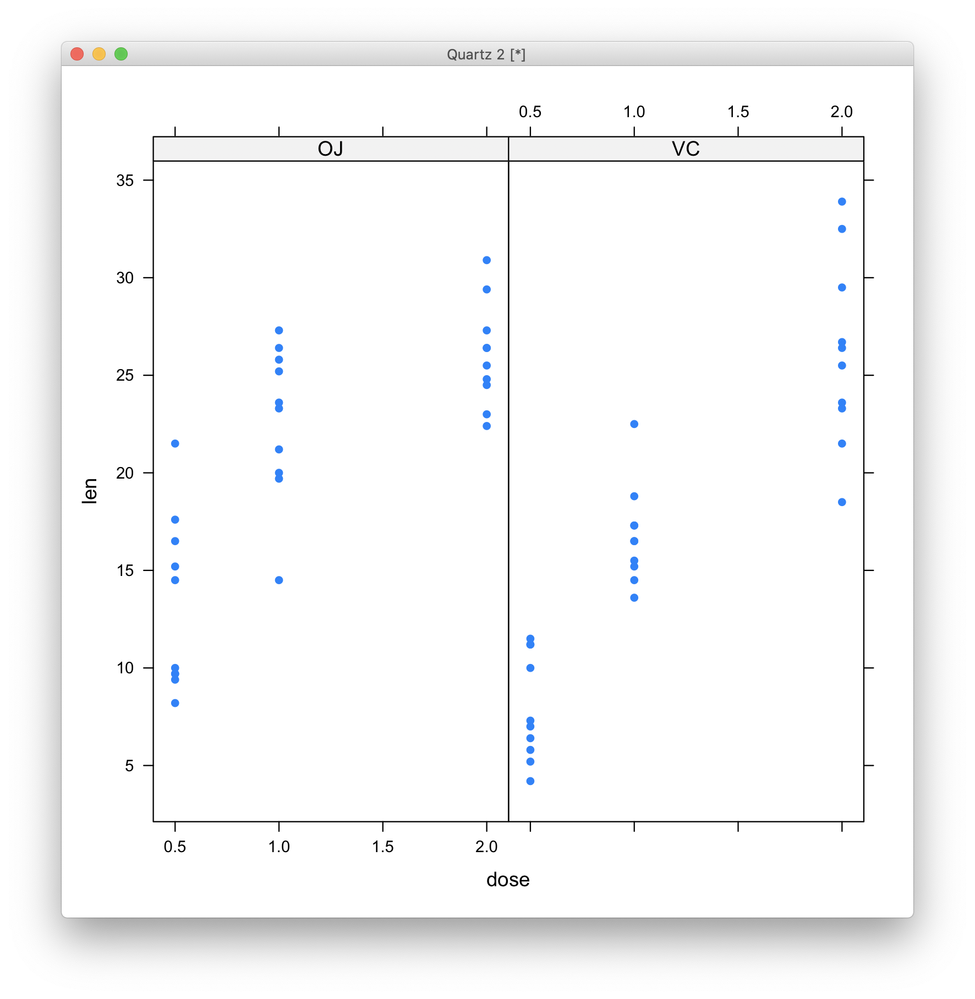
:::

Pour la suite (tests d'hypothèses), nous nous intéresserons à la variation moyenne pour chaque traitement et chaque dose. Un graphique existe pour montrer cela\ : le `Graphe des moyennes`. Si vous lancez cette commande, vous pourrez sélectionner `supp` comme facteur et `len` comme variable réponse, **mais pas `dose` comme second facteur**. En effet, `dose` est actuellement encodé comme une variable numérique. Avec trois niveaux seulement (0.5, 1, ou 2 mg/jour) nous devrions cependant considérer cette variable comme qualitative et la transformer en `factor`.

Quittez la boite de dialogue du graphique et effectuez cette transformation en plaçant les données transformées dans la variable `dosef`. Vous vous rappelez comment faire cela\ ? Réfléchissez un peu avant de lire plus avant...

La transformation se fait à partir de `Données` -> `Gérer les variables du jeu de données actif` -> `Convertir des variables numériques en facteurs...`. **Précisez bien `dosef` comme nouveau nom** et utilisez simplement les nombres comme labels des 3 niveaux de la variable. Ensuite, retentez un graphique des moyennes en sélectionnant `supp` et `dosef` comme facteurs et `len` comme variable réponse. Allez dans l'onglet **Options** et choisissez ce que vous voulez représenter comme barres d'erreurs, par exemple, les intervalles de confiance à 95%  (le plus utile par rapport à des tests de comparaison de moyennes que nous ferons ensuite). Vous obtenez ceci\ :

::: {.center data-latex=""}
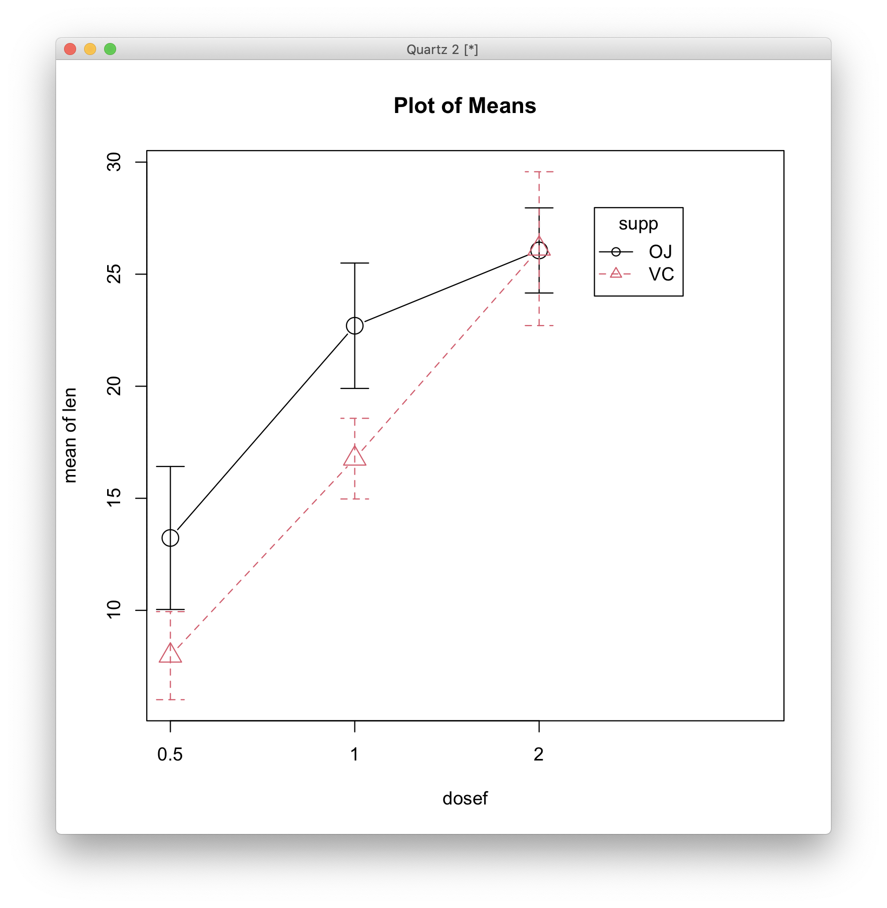
:::

Ce graphique, s'il n'est pas le plus esthétique, montre bien l'effet d'une augmentation de la dose sur l'allongement. cet effet est plus marqué avec le jus d'orange aux faibles doses, mais l'effet est identique à 2mg/jour. Pour 1mg/jour, le contraste est important entre les deux types de supplémentations.

*Pour les graphiques comme pour tout le reste, R et R Commander prédétermine le rôle des différentes variables du jeu de données en fonction de la manière dont elles sont encodées. Pensez donc bien à les convertir dans le bon format avant vos analyses\ !*

## Exportation des graphiques

Peaufinez vos graphiques à l'aide le l'onglet **Options** (et éventuellement, choisissez vos couleurs dans le menu `Graphes` -> `Palette de couleurs...`). Une fois le graphique final obtenu, vous pouvez enregistrer votrte graphique dans un fichier, soit au format bitmap (PNG), soit au format vectoriel (PDF) à partir du menu `Graphes` -> `Enregistrer le graphe dans un fichier...`. Vous pouvez régler la taille du graphique, la résolution pour le bitmap et la taille du texte. Ces graphiques sont utilisables ensuite dans Word ou Powerpoint, par exemple.

# Tests d'hypothèses

Nous allons maintenant effectuer deux tests d'hypothèses\ : un test de Student pour la dose de 1 mg/jour, et ensuite une ANOVA à deux facteurs sur l'ensemble du jeu de données.

## Préparation pour le test de Student

Nous commençons par réduire notre jeu de données aux observations uniquement réalisées à la dose de 1 mg/jour que nous placerons dans la variable `ToothGrowth1`. Vous vous rappelez comment faire cela\ ? Réfléchissez avant de lire la suite...

Nous allons utiliser l'outil `Données` -> `Jeu de données actif` -> `Sous-ensemble...`. Nous incluons toutes les variables. L'expression de sélection est\ : `dose == 1` (**attention\ : il faut deux signes `=` dans R pour indiquer l'égalité**), et enfin nous indiquons `ToothGrowth1` comme nom du nouveau jeu de données.

::: {.center data-latex=""}
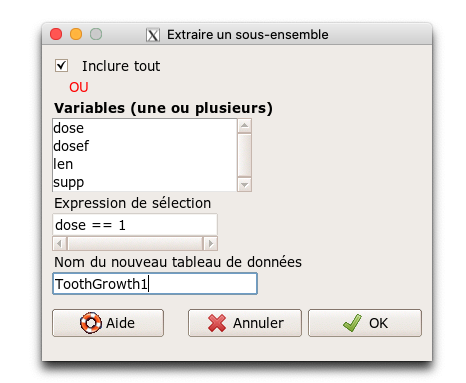
:::

Visualisez les données pour vérifier que ce que vous obtenez correspond bien aux données uniquement pour la dose de 1mg/jour.

## Test de Student

Le test de Student compare les moyennes de deux populations distinctes et permet de déterminer si elles sont significativement différentes l'une de l'autre. Il en existe plusieurs variétés. Ici, les cochons d'Inde des deux sous-populations sont des individus différents. Cela correspond au test t de Student indépendant (l'explication de ce qu'est un test de Student et de ses différentes variantes n'est pas prévue dans cette démo... voyez vos ouvrages de statistique favoris pour cela). Nous allons maintenant effectuer ce test sur `ToothGrowth1`. Allez dans le menu `Statistiques` -> `Moyennes` -> `t-test indépendant...`. La variable de groupe est `supp` et la variable réponse est `len`.

::: {.center data-latex=""}
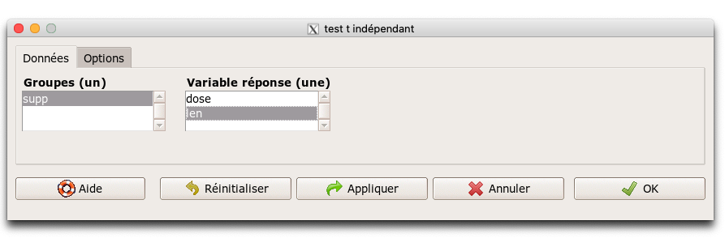
:::

Si vous observez bien, vous constaterez que la variable `dosef` n'est reprise ni dans les variables de groupes, ni dans les variables réponses. `dosef` est une variable `factor`. Donc, logiquement, elle devrait apparaître dans les groupes, **mais pour le test de Student, seules les variables qualitatives à deux niveaux sont permises**, or `dosef` possède 3 niveaux (0.5, 1, et 2), et ce, même si le jeu de données a été simplifié à un seul niveau. En fait, les niveaux initiaux de la variable sont conservés. C'est un piège fréquent dans R Commander que d'oublier cela\ ! (l'outil `Données` -> `Gérer les variables du jeu de données azctif` -> `Retirer les niveaux de facteurs non utilisés...` permet d'"oublier" les niveaux non représentés dans un jeu de données, si nécessaire).

Dans l'onglet **Options**, nous pouvons choisir la variante bilatérale, unilatérale à gauche ou à droite du test. Nous pouvons aussi imposer que les variances soient égales dans les deux sous-populations (test de Student classique), ou différentes (variante de Welch de ce test). Ici, les valeurs proposées par défaut conviennent très bien.

::: {.center data-latex=""}
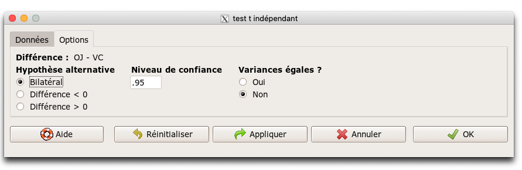
:::

Vous obtenez la sortie textuelle suivante qui est typique de la façon dont R présente le résultat d'un test d'hypothèse\ :

::: {.center data-latex=""}
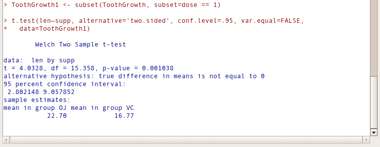
:::

Vous avez ici tout ce qu'il faut pour interpréter ce test. Il est indiqué que c'est le test de Welch (donc variances non supposées comme égales entre les deux sous-populations) pour échantillons indépendants ("two samples") qui est utilisé ici. Nous pouvons voir tout en bas que les moyennes respectives de `len` sont 22,70 pour le jus d'orange et 16,77 pour la vitamine C. Ces deux moyennes sont significativement différentes au seuil $\alpha$ de 5% car la valeur p du test ("p-value") est de 0,0010, ce qui est inférieur à ces 5% (notez que le seuil $\alpha$ est le complément à 1 du niveau de confiance choisi, donc, 1 - 95% = 5%).

*Comme vous pouvez le constater, le logiciel ne choisit pas, ni n'interprète pour vous les tests d'hypothèses. Il ne vous guide pas, à part pour les restrictions sur les variables utilisables dans un contexte donné. Vous devez pouvoir faire cela par vous-même. C'est voulu\ : cela permet d'éviter que n'importe qui fasse n'importe quoi. Il faut comprendre les statistiques qu'il y a derrière les outils pour sélectionner les bonnes options et interpréter ensuite correctement les analyses\ !*

## Analyse de variance

Comparer les supplémentations uniquement à la dose de 1 mg/jour est un peu frustrant ici car le jeu de données complet contient plus d'information. Nous pouvons traiter le jeu de données complet au travers d'un ANOVA à deux facteurs. Resélectionnez `ToothGrowth`comme jeu de données actif. Pour cela, cliquez sur le bouton `ToothGrowth1`bleu à droite de "Données:". Une liste apparaît avec tous les jeux de données en mémoire. Choisissez de rendre `ToothGrowth` actif.

::: {.center data-latex=""}
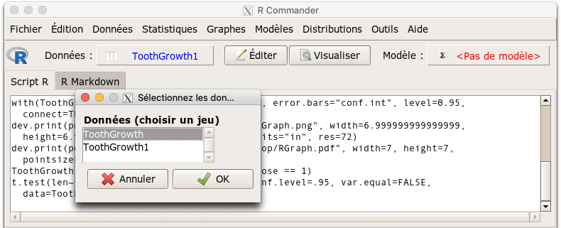
:::

Ensuite, vous allez dans le menu `Statistiques` -> `Moyennes` -> `ANOVA à plusieurs facteurs...`. Vous sélectionnez `dosef` et `supp` comme facteurs et `len` comme variable réponse et vous lancez l'analyse. À nouveau, R vous renvoie les résultats dans la zone "Sortie" de R Commander.

::: {.center data-latex=""}
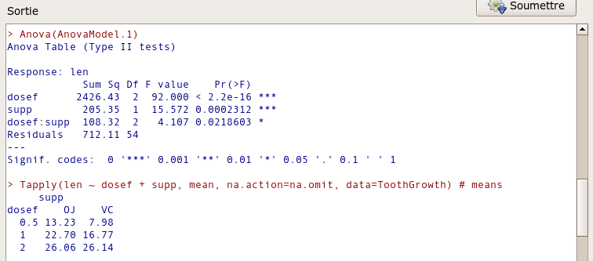
:::

Le tableau de l'ANOVA indique que, toujours au seuil $\alpha$ de 5% (que nous avons choisi avant de réaliser le test), à la fois la dose et le supplément ont un effet significatif sur l'allongement moyen. Pour conclure cela, nous comparons les valeurs P dans la colonne "Pr(>F)" au seuil $\alpha$ choisi. L'effet est considéré comme significatif si la valeur P est inférieure à ce seuil.

Le tableau de l'ANOVA reprend l'effet dose en première ligne, l'effet supplémentation en seconde ligne. Comme c'est un modèle complet, il reprend aussi les **interactions** entre la dose et le supplément, notées `dosef:supp` en troisième ligne, et enfin les résidus en quatrième ligne. 
Au seuil $\alpha$  de 5%, les interactions sont également significatives. Cela signifie que le comportement des deux supplémentations n'est pas le même aux différentes doses. Nous l'avions déjà observé graphiquement. *En présence d'interactions, nous ne pouvons malheureusement pas conclure concernant les effets individus `dosef` et `supp` et devons donc analyser le modèle dans son ensemble.*

# Exercices supplémentaires

Cet exemple vous a permis de découvrir comment réaliser des graphiques et des tests d'hypothèses dans R Commander. Il est naturellement possible de réaliser d'autres graphiques et tests. À titre d'exercices complémentaires, faites ceci\ :

- Un histogramme de distribution de la variable `len` toutes doses et supplémentations confondues pour `ToothGrowth`,

- Vérifiez que l'ANOVA est utilisable sur `ToothGrowth` via un test d'homogénéité des variances de Bartlett (une des conditions initiales requises pour que l'ANOVA puisse être utilisée),

- Un test non paramétrique de Wilcoxon bivarié sur `ToothGrowth1` à la place du test de Student (n'oubliez pas de changer de jeu de données actif).
