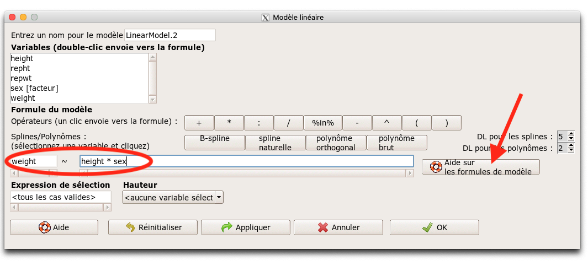
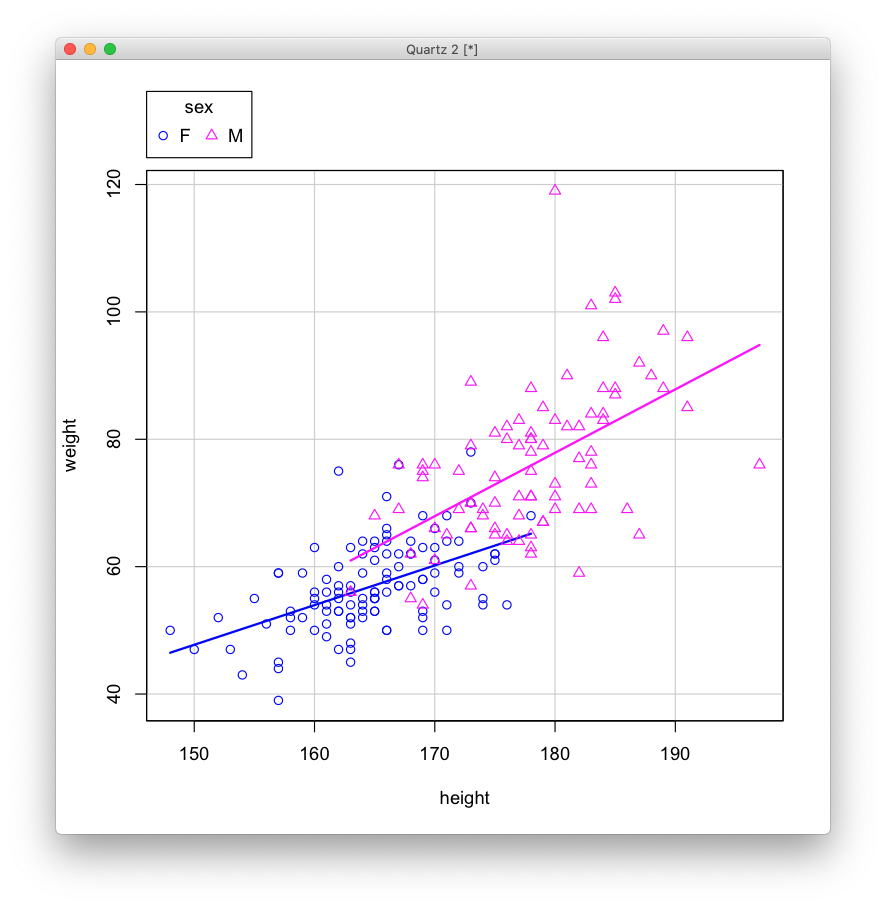

```{r setup, include=FALSE}
knitr::opts_chunk$set(echo = TRUE, fig.align = "center")
```


\vspace{12cm}

------------------------------------------------------------------------

::: {.center data-latex=""}
*Ce document est une contribution à [STAT for U](https://github.com/STATforU).*


:::

\newpage

# Se préparer...

Démarrez R Commander et chargez le jeu de données `Davis` du package {carData}. Vous devez donc faire `Données` -> `Données dans les paquets` -> `Lire des données depuis un paquet attaché...`. Tant que vous êtes dans cette boite de dialogue, affichez le fichier d'aide associé à ce jeu de données pour le découvrir. Ensuite, ouvrez le jeu de données (bouton **OK**).

::: {.center data-latex=""}

:::

Prenez l'habitude de **visualiser** votre tableau de données juste après son importation pour vérifier qu'il se présente comme prévu (bouton **Visualiser** dans la barre d'outils).

Pour les analyses statistiques plus complexes comme les modèles linéaires, linéaires généralisés, etc., R travaille en plusieurs étapes\ :

1. Création d'un objet qui contient toutes les informations nécessaires relatives au modèle,
2. Appel à des fonctions spécialisées (on les appelle des **méthodes** de l'objet) pour obtenir plus d'inbformation sur l'analyse en cours,
3. Utilisations de graphiques également **spécialisés**

Donc, contrairement à d'autres logiciels de statistiques qui crachent plusieurs pages de résultats sur tout ce qui pourrait éventuellement vous être utile dans le contexte de votre analyse (oui, SPSS par exemple), vous devez apprendre à aller piocher les items qui vous intéressent par vous-mêmes dans R et R Commander.

**Cette approche est voulue et a démontré son intérêt, car il faut être bien conscient des éléments nécessaires à l'analyse et au diagnostic du modèle... et donc, il faut comprendre ce que l'on fait pour s'en sortir avec R\ !**

# Description et visualisation des données

La description des données est toujours la première étape à réaliser. Nous ferons une description numérique et une visualisation graphique, toutes deux adaptées à l'étude qui nous intéresse, à savoir, **un modèle linéaire est-il pertinent pour représente la masse (variable `weight`, en kg) par rapport à la taille (`height` en cm) chez l'adulte, ou en tous cas dans la population ciblée par l'étude, éventuellement en fonction du sexe (variable `sex`, avec les modalités `F` et `M`).**

## Description numérique

- Le plus simple est d'utiliser `Statistiques` -> `Résumés` -> `Jeu de données actif`. Vous obtenez ceci\ :

::: {.center data-latex=""}

:::

Nous pouvons voir, pour les variables quantitative, les cinq nombres (min, 1er quartile, médiane, 3ème quartile et max), ainsi que la moyenne et une indication éventuelle du nombre de valeurs manquantes (`NA's`. Pour les variables qualitatives, nous avons les proportions pour chaque modalité). Sachant que `repwt` et `repht` sont les masses et tailles indiquées par les sujets, ne voyez)vous pas déjà une anormalité ici\ ?

Si on s'intéresse à la relation linéaire entre deux variables, nous pouvons plutôt commencer par calculer le coefficient de corrélation linéaire de PEarson entre ces variables. Faites `Statistiques` -> `Résumés` -> `Matrice de corrélation...`. Ensuite, vous sélectionnez les quatre variables (utilisation de `Shift` en sélectionnant). Prenez un moment pour analyser ce tableau.

::: {.center data-latex=""}

:::

## Visualisation des données

Plusieurs graphiques différents sont utilisables ici, mais le plus pertinent est le nuage de points. Allez dans le menu `Graphes` -> `Nuage de points`. Sélectionnez `height` comme variable x, et `weight` comme variable y, cliquez sur **Graphe par groupe...** et sélectionnez `sex`, puis cliquez sur le bouton **OK**.

::: {.center data-latex=""}

:::

Vous devez obtenir le graphique suivant\ :

::: {.center data-latex=""}

:::

Vous notez immédiatement la présence d'un point anormal\ ! Il semblez que la masse et la teille aient été inversés pour une femme car 165kg pour une taille de 58cm, ce n'est pas vraiment possible. Après vérification, nous décidons donc d'éliminer ce point. Tentez de le faire par vous-mêmes avant de lire plus loin.

Nous allons dans le menu `Données` -> `Jeu de données actif` -> `Sous-ensemble..` et nous rentrons par exemple `height > 100` dans la case **Expression de sélection** pour éliminer cet individu adulte soi-disant de 58cm de haut. Cliquez sur **OK** et confirmez le remplacement du tableau. **Nous ne devrons pas oublier dans notre publication d'expliquer cette étape.**

::: {.center data-latex=""}

:::

Ensuite, nous refaisons une description numérique et graphique du jeu de données nettoyé. Notez comme le coefficient de corrélation de Pearson est passé d'un très maigre 0.154 à un bien meilleur 0.768 après cette opération. Voici le nouveau graphique avec les mêmes options que précédemment\ :

::: {.center data-latex=""}

:::

Ce que nous observons nous encourage à tenter une régression linéaire dans ces données. soit un modèle unique pour les hommes et les femmes, soit un modèle plus complexe qui tiendrait compte des différences en fonction du sexe.

# Régression linéaire

La première étape consiste à créer le modèle dans R (R commander visualise automatiquement un résumé numérique du modèle par la suite). Allez dans `Statistiques` -> `Ajustement de modèles` -> `Régression linéaire...`. Sélectionnez la variable `weight` comme réponse et `height` comme explicative et puis **OK**. Vous voyez un résumé du modèle (son contenu est riche, mais nous ne pouvons le détailler ici. Je vous renvoie au cours de Science des Données Biologiques, ici: https://wp.sciviews.org/sdd-umons2/?iframe=wp.sciviews.org/sdd-umons2-2021/r%25C3%25A9gression-lin%25C3%25A9aire-simple.html%23r%25C3%25A9sum%25C3%25A9-avec-summary et ici: https://wp.sciviews.org/sdd-umons2/?iframe=wp.sciviews.org/sdd-umons2-2021/outils-de-diagnostic-suite.html).

::: {.center data-latex=""}

:::

Même avec un R^2^ assez faible de 0.59, notre modèle est significatif (ANOVA résumé à la dernière ligne et test de Student sur les deux paramètres). Notre modèle est\ : weight (kg) = 1.15 * height (cm) - 131.

Pour avoir d'autres informations sur notre modèle, rappelons-nous qu'il faut les demander explicitement dans R. Tout cela se trouve dans le menu `Modèle` de R Commander. Par exemple, le tableau de l'ANOVA complète liée au modèle qui nous dit s'il est significatif ou pas peut-être otenue à l'aide de `Modèles` -> 
`Tests d'hypothèses` -> `Table d'ANOVA...`. Gardez les options proposées et cliquez sur le bouton **OK** dans la boite de dialogue qui s'ouvre. Vous obtenez ceci\ :

::: {.center data-latex=""}

:::

Vous voyez bien que la dernière ligne du résumé de notre modèle correspond à l'ANOVA du modèle. Nous pouvons calculer bien d'autres choses (explorez le menu `Modèles`). Par exemple, nous pouvons calculer le critère d'Akaike pour ce modèle (un critère qui permet de comparer différents modèles ajustés dans le même jeu de données et de choisir celui qui présent la valeur d'AIC la plus faible, éventuellement). Faites `Modèles` -> `Critère d'information d'Akaike (AIC)`. Vous devriez obtenir la valeur de 1421.

## Analyse des résidus

Les résidus du modèle (la partie non expliquée) doivent avoir une distribution Normale et une variance homogène le long de la droite. Ce sont deux parmi les conditions d'application de la régression linéaire par les moindres carrés. Il faut aussi que le nuage de points soit linéaire, qu'il n'y ait pas de valeurs extrêmes suspectes, pas de valeurs trop influentes, etc. R et R Commander vous propose une série de graphiques pour diagnostiquer tout cela dans une troisième étape. Il s'agit des graphiques d'**analyse des résidus**. Allez dans le menu `Modèles` -> `Graphes` -> `Diagnostics graphiques`. Vous obtenez ceci\ :

::: {.center data-latex=""}

:::

Ces quatre graphiques vous permettent déjà de détecter pas mal de problèmes potentiels. Leur description va au delà de cette petite démonstration, mais vous pouvez avoir plus d'informations et un exemple d'utilisation dans le cours de science des données biologiques ici\ : https://wp.sciviews.org/sdd-umons2/?iframe=wp.sciviews.org/sdd-umons2-2021/outils-de-diagnostic.html.

En gros, dans le cas présent, nous ne détectons pas d'anomalies particulière, si ce n'est un point extrême (la ligne 21 du tableau) mais non suspect. De plus, la linearité du nuage de points n'est pas parfaite, mais pas trop gênante.

## Modèle linéaire plus complexe

Nous allons terminer cette exploration rapide des fonctionnalités de modélisation de R Commander en réalisant un **modèle linéaire** plus complexe qui tiendra compte de différences entre hommes et femmes. Pour cela, nous allons dans le menu `Statistiques` -> `Ajustement de modèles` -> `Modèle linéaire...`. Ici, l'interface est beaucoup plus compliquée, à l'image des possibilités immenses de ce type de modèle.

Nous devons spécifier ici une **formule** qui va représenter la relation entre les variables dans notre modèle. La régression linéaire simple réalisée plus haut correspond au modèle `weight ~ height` qui se lit "weight en fonction de height". Cette formule est déjà rentrée. Nous allons ajouter une seconde variable au modèle\ : `sex` en écrivant `weight ~ height * sex` (vous avez un bouton qui vous renvoie à la page d'aide qui explique comment élaborer une formule pour un modèle linéaire dans la boite de dialogue)\ :

::: {.center data-latex=""}

:::

Cliquez **OK**. Votre modèle est calculé et son résumé est affiché.

::: {.center data-latex=""}

:::

Ici aussi, vous êtes supposé utiliser les différents outils de diagnostic pour étudier votre modèle et vérifier s'il répond bien aux hypothèses de départ de normalité et d'homogénéité de la variance des résidus, etc. Les mêmes outils que précédemment sont aussi utilisables ici. Par exemple, calculons le critère d'Akaike, ce qui donne 1400, soit une valeur légèrement plus basse que pour le modèle plus simple qui ne prend pas en compte les différences homme - femme. Il faudrait l'analyser plus en détails, mais il semble que ce nouveau modèle est pertinent. Pour le visualiser, vous pouvez faire `Graphes` -> `Nuage de points...`, sélectionner `height` comme x, `weight` comme y, et `sex` pour le groupe. Ensuite dans l'onglet **Options**, vous cochez **ligne des moindres carrés**. Vous obtenez ceci\ :

::: {.center data-latex=""}

:::

Nous n'avons fait que survoler les possibilités en matière de modélisation du logiciel. De plus, des addins existent pour aller encore plus loin. L'important est ici de réaliser les deux points suivants\ :

1. R et R Commander ne crachent pas tous les résultats possibles et imaginables en relation avec un modèle. Vous devez aller les chercher *sélectivement* par vous-mêmes (dans le menu `Modèles` dans le cas de R Commander).
2. Pour les modèles plus complexes, R et R Commander utilisent une interface particulière dite "formule" qui permet de spécifier très finement la relation entre les différentes variables dans le modèle.

# R Markdown

Jusqu'ici, nous n'avons utilisé que le **Script R** qui reprend les différentes commandes à exécuter. Vous pouvez le souvegarder et le rejouer quand vous voulez à l'aide su bouton **Soumettre**. C'est pratique car cela permet de trracer les analyses réalisées, voire de les reprendre dans un autre contexte si vous avez plusieurs jeux de données similaires à analyser.

L'onglet **R Markdown** donne accès à une autre fonctionnalité qui permet de *créez des rapports formatés en HTML, PDF, Word, Powerpoint, etc. Le principe est le suivant. Vous avez trois zones distinctes dans le document\ :

1. Un entête dit "YAML" qui spécifie quoi faire avec le document (par exemple le compiler en un fichier PDF) et indique des données générales comme le titre, la date, l'auteur,
2. Des zones de texte libre qui peut être formaté à l'aide de balisesz **Markdown** (voir ici\ : https://rmarkdown.rstudio.com/ et ici\ : https://rmarkdown.rstudio.com/lesson-8.html)
3. Des **chunks** qui contiennent du code R. Lors del a compilation du document, ces chunks sont exécutés et remplacés par le résultat, par exemple, un graphique ou un tableau.

Ainsi, les documents R Markdown permettent d'effectuer les calculs statistiques et les graphiques *directement dans le même document que celui qui génère le rapport*. Visualisez la petite vidéo sur cette page pour une autre explication\ : https://rmarkdown.rstudio.com/lesson-1.html.

## Rapport de nos analyses

R Commander propose une version très light de R Markdown dans l'onglet correspondant. Par exemple, pour générer un rapport des analyses que nous venons de faire, allez dans l'onglet **R Markdown** et cliquez sur le bouton **Générer un rapport**. Vous verrez une page HTML apparaître avec le résultat de vos analyses.

Vous pouvez naturellement éditer la partie texte (et même les "chunks") de ce rapport. Changez le titre en "Masse en fonction de la taille chez les adultes". Indiquez votre nom à la place de "Your Name" et écrivez une petite phrase d'introduction juste après "### `r as.character(Sys.Date())`", par exemple, "Les données utilisées dans cette étude sont issues de Davis (1990).".

Régénérez votre rapport, vous devez obtenir quelque chose comme ceci\ :

::: {.center data-latex=""}

:::

Markdown propose de nombreux formatages, et vous pouvez même gérer et générer la bibliographie de votre rapport au format de différentes revues. Pour sauvegarder votre rapport, vous faites `Fichier` -> `Enregistrer un fichier R Markdown...`, donc de manière similaire à l'enregistrement d'un script R (mais avec extension `.Rmd` au lieu de `.R` pour le script). Tout comme votre script, vous pouvez recharger un document R Markdown et le "rejouer" pour recréer votre rapport.

## R Markdown dans R Studio (démo)

R Commander est un bon logiciel pour un utilisateur débutant ou occasionel, mais si vous vous lancez dans des fonctions plus avances (telles que justement les documents R Markdown), vous allez rapidement être embêtés par les limitations du logiciel. Dans ce cas, tout en conservant les bonnes habitudes de R qui est sous-jacent aux deux logiciels, vous pouvez passer sur **RStudio** (voir https://www.rstudio.com/). Là, les possibilités de manipulation, de formatage et de sortie à partir de R Markdown sont décuplées.

*Démonstration de l'ouverture du fichier R Markdown sauvegardé à partir de R Commander et génération de différents formats de sortie.*

# Exercices supplémentaires

Pour les modèles\ :

- Effectuez l'analyse des résidus pour votre modèle complet qui tient compte du sexe.

- Explorez d'autres types de modèles à partir de `Statistiques` -> `Ajustement de modèles`.

- Explorer les formatages Markdown dans une zone de texte à l'intérieur de votre rapport, par exemple, pour mettre en italique, vous encadrez le passage d'une astérisque avant et après. Pour le mettre en gras, vous utilisez deux astérisques avant et après. Pour un titre, vous le précédez de un à six dièses ("hashtags" #) suivi d'une espace et placez ce titre sur sa propre ligne encadrée de lignes vides. Pour plus d'idées de formattage, voyez l'aide-mémoire de Markdown ici\ : https://github.com/rstudio/cheatsheets/raw/master/rmarkdown.pdf.
